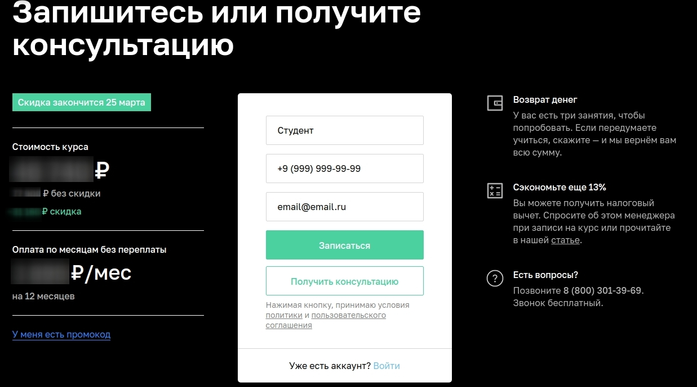
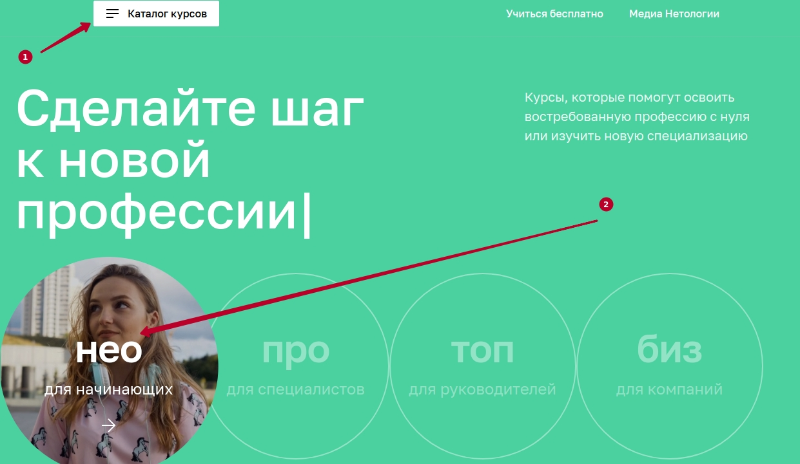
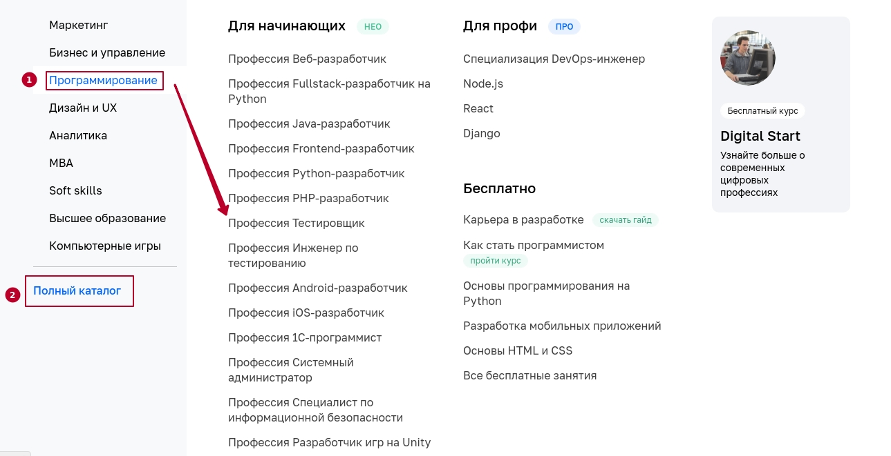

# Домашнее задание к занятию «10. Заключительная лекция»

### Внедрение автоматизации

Поскольку у вас уже есть опыт в автоматизации, неплохо бы начать учиться планировать.

**Важно**: у вас нет разрешения на тестирование и автоматизацию. Поэтому вы не должны тестировать и автоматизировать, вы должны только **составить план**.

Что вам нужно сделать: внимательно изучить [веб-сайт Нетологии](https://netology.ru).

Что мы хотим запланировать: тестирование возможности записаться на обучение профессии «Тестировщик ПО»:

Попасть на эту форму со страницы профессии можно тремя способами: пролистать всю страницу профессии до формы записи, а также нажатием одной из двух кнопок «Записаться» на странице профессии.
А вот способы попасть на страницу профессии с главной страницы сайта вам предстоит исследовать самостоятельно. Это можно сделать как через меню «Каталог курсов», так и через некоторый контент на главной странице.

Где можно начать искать страницу с профессией на главной странице сайта:

Варианты поиска через меню «Каталог курсов»:

**Важно**: вы не должны отправлять форму нажатием кнопки «Записаться», вам стоит лишь написать сценарии заполнения формы, учитывая известную информацию о ней и здравый смысл. Это реальный сайт, и каждая отправленная форма приходит как запрос на запись курса. Будьте осторожны!

Что нужно сделать: нам нужен от вас план автоматизации тестирования сценария перехода к форме записи и заполнения этой формы.

Что должно быть в плане:
1. Перечень автоматизируемых сценариев.
1. Перечень используемых инструментов с обоснованием выбора.
1. Перечень необходимых разрешений, данных и доступов.
1. Перечень и описание возможных рисков при автоматизации.
1. Перечень необходимых специалистов для автоматизации.
1. Интервальная оценка с учётом рисков в часах.

Формат плана — свободный, но количество разделов должно соответствовать списку, и документ должен быть оформлен аккуратно, по всем правилам.

**Напоминаем ещё раз**: у вас нет разрешения на тестирование и автоматизацию. Поэтому вы не должны тестировать и автоматизировать отправку формы, вы должны только **составить план**.
