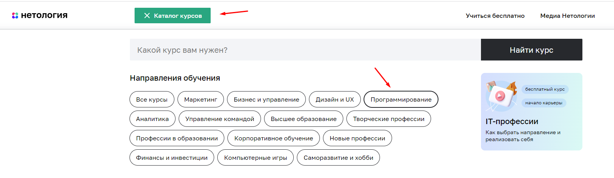
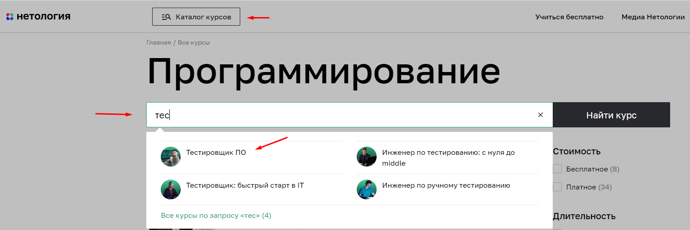
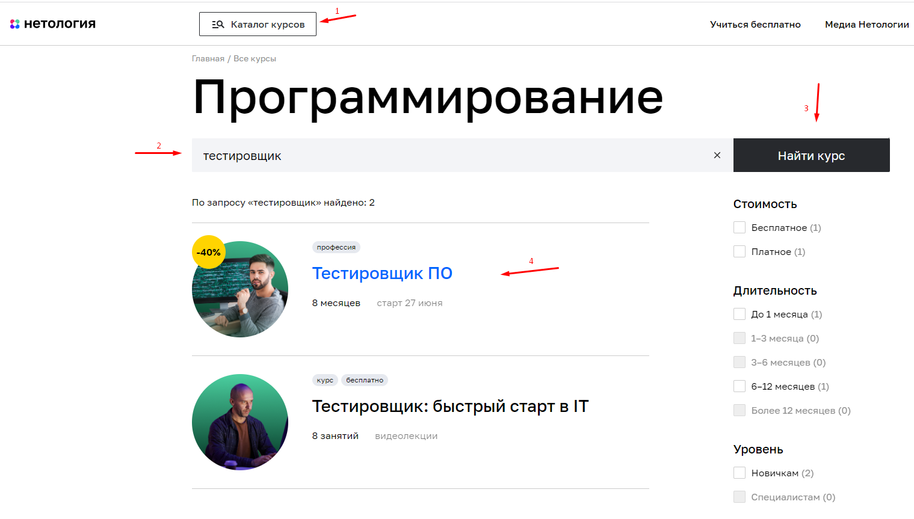
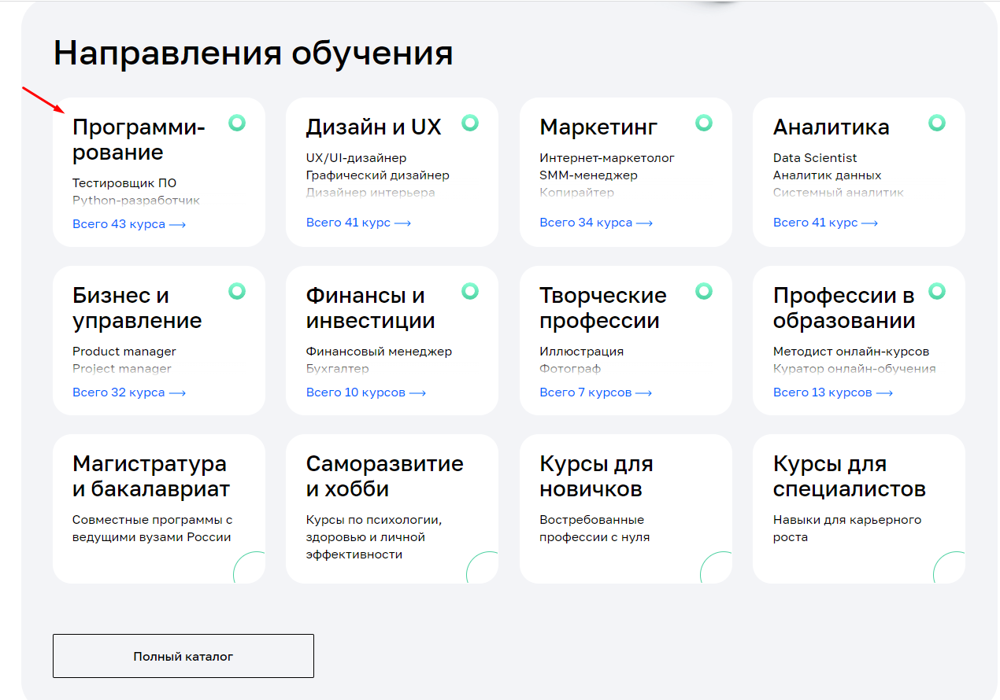
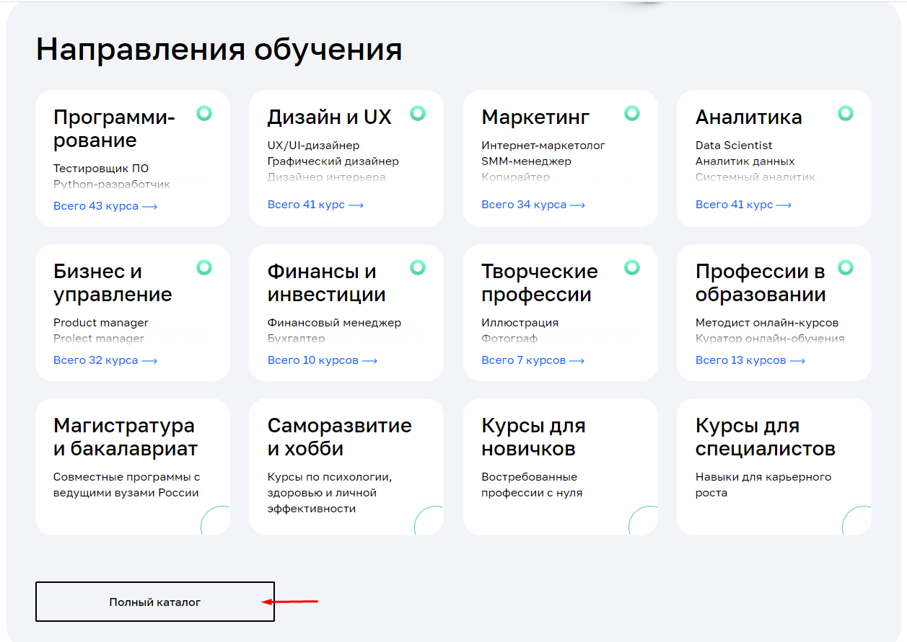
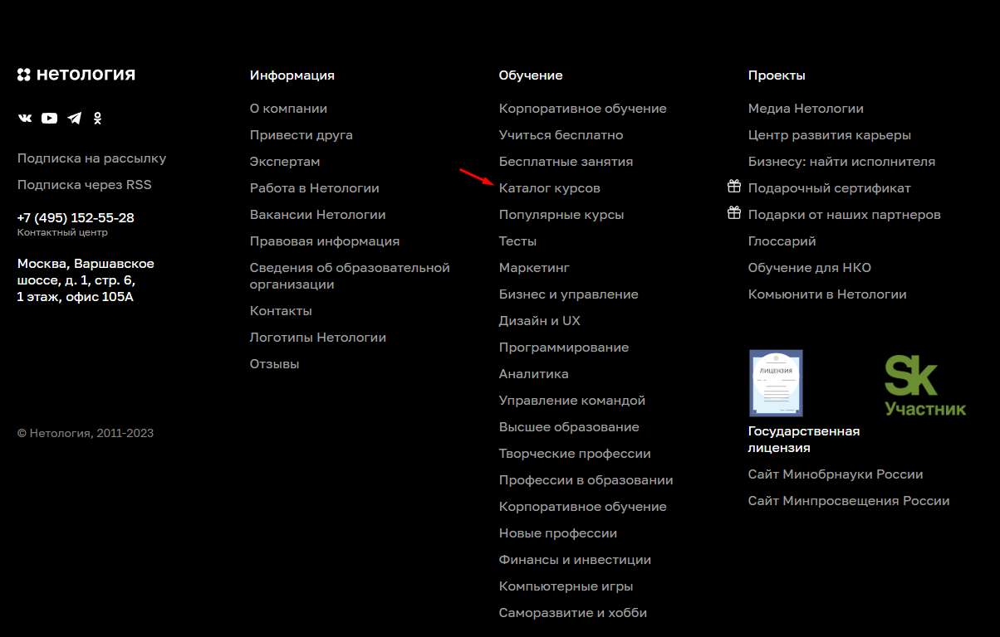
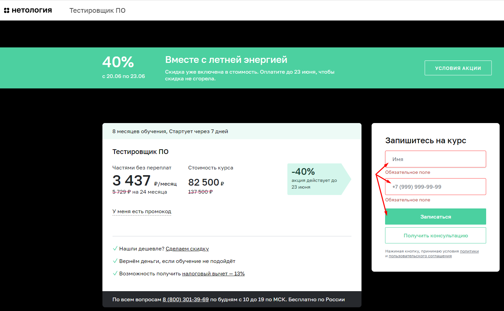

# План автоматизации тестирования возможности записи на обучение профессии "Тестировщик ПО"

## Перечень автоматизируемых сценариев:

### Сценарии перехода с [главной страницы сайта](https://netology.ru) на страницу профессии «Тестировщик ПО»:

#### Предусловие для выполнения сценария:
- Ввод адреса страницы  (https://netology.ru) в адресную строку своего браузера
- Переход по [ссылке](https://netology.ru) на сайт Нетологии

**Сценарий №1:**
1. На главной странице сайта нажать кнопку "Каталог курсов"
2. Во всплывающем окне нажать "Программирование"

3. Пролистать страницу до нужной профессии "Тестировщик ПО"
4. Кликнуть по карточке "Тестировщик ПО".

**Сценарий №2:**
1. На главной странице сайта нажать кнопку "Каталог курсов"
2. В поисковой строке начать вводить "тестировщик"
3. Во всплывающем окне выбрать "Тестировщик ПО"

**Сценарий №3:**
1. На главной странице сайта нажать кнопку "Каталог курсов"
2. В поисковой строке ввести "тестировщик"
3. Нажать кнопку "Найти курс"
4. Из выданных вариантов выбрать "Тестировщик ПО" и кликнуть по карточке

**Сценарий №4:**
1. На главной странице в разделе "Направления обучения" выбрать "Программирование"
2. Прокрутить страницу до  карточки "Тестировщик ПО"
3. Кликнуть по карточке "Тестировщик ПО"

**Сценарий №5:**
1. На главной странице в разделе "Направления обучения" нажать "Полный каталог"
2. Прокрутить страницу до карточки "Тестировщик ПО"
3. Кликнуть по карточке "Тестировщик ПО"

**Сценарий №6:**
1. Прокрутить главную страницу до конца
2. Нажать на "Каталог курсов"
3. Прокрутить страницу до карточки "Тестировщик ПО"
4. Кликнуть по карточке  "Тестировщик ПО"

#### Общий итог всех сценариев: открылась страница курса "Тестировщик ПО".

### Сценарии перехода на странице курса "Тестировщик ПО" к форме регистрации на курс:

#### Предусловие выполнения сценария:
открыта страница курса "Тестировщик ПО"

**Сценарий №1:**
1. Нажать кнопку "Записаться".

**Сценарий №2:**
1. Прокрутить страницу с курсом "Тестировщик ПО" вниз
2. В окне заполнить обязательные поля и нажать кнопку "Записаться".

### Сценарии заполнения и отправки формы регистрации на курс:

#### Заполнение анкеты для неавторизованных пользователей:

##### Сценарий HappyPath:
1. Заполнить поле "Имя" валидными значениями:
     - не менее двух букв на кириллице или латинскими буквами
2. Заполнить поле "Номер телефона" валидными значениями согласно шаблону:
     - форма ввода: +7 (999) 999-99-99
3. Заполнить поле "Электронная почта" корректным e-mail:
  - не должен содержать русских букв
  - знак «собака» (@)
  - точку (.)
  - верное наименование почтового домена (mail.ru, yandex.ru, gmail.com и так далее)
4. Кликнуть по кнопке "Записаться" - произойдет переход к экранной форме записи.
##### Ожидаемый результат: появляется сообщение об успешной записи

##### Сценарий UnHappyPath:
**Сценарий №1:**
1. Заполнить поле "Имя" одной буквой
2. Заполнить поле "Номер телефона" валидным значением
3. Заполнить поле "Электронная почта" валидным значением
4. Кликнуть по кнопке "Записаться".
##### Ожидаемый результат: появляется сообщение "Поле Имя должно быть не короче 2 символов".

**Сценарий №2:**
1. Заполнить поле "Имя" цифрами, спецсимволами
2. Заполнить поле "Номер телефона" валидным значением
3. Заполнить поле "Электронная почта" валидным значением
4. Кликнуть по кнопке "Записаться".
##### Ожидаемый результат: появляется сообщение "Поле Имя должно состоять из букв".

**Сценарий №3:**
1. Заполнить поле "Имя" валидным значением
2. Заполнить поле "Номер телефона" не по шаблону/буквами
3. Заполнить поле "Электронная почта" валидным значением
4. Кликнуть по кнопке "Записаться".
##### Ожидаемый результат: появляется сообщение "Поле Номер телефона должен быть заполнен в формате +7 (999) 999-99-99".

**Сценарий №4:**
1. Заполнить поле "Имя" валидным значением
2. Заполнить поле "Номер телефона" валидным значением
3. Заполнить поле "Электронная почта" русскими буквами,
   без знака «собака» (@),
   без точки (.),
   неверным доменом
4. Кликнуть по кнопке "Записаться".
##### Ожидаемый результат: появляется сообщение "Неверный email".

**Сценарий №5:**
1. Не заполнять поле "Имя"
2. Заполнить поле "Номер телефона" валидным значением;
3. Заполнить поле "Электронная почта" валидным значением;
4. Кликнуть по кнопке "Записаться".
##### Ожидаемый результат: появляется сообщение "Должно быть заполнено Обязательное поле".

**Сценарий №6:**
1. Заполнить поле "Имя" валидным значением
2. Не заполнять поле "Номер телефона"
3. Заполнить поле "Электронная почта" валидным значением
4. Кликнуть по кнопке "Записаться".
##### Ожидаемый результат: появляется сообщение "Должно быть заполнено Обязательное поле".

**Сценарий №7:**
1. Заполнить поле "Имя" валидным значением
2. Зполнить поле "Номер телефона" валидным значением
3. Не заполнять поле "Электронная почта"
4. Кликнуть по кнопке "Записаться".
##### Ожидаемый результат: появляется сообщение "Должно быть заполнено Обязательное поле".
#### Общий ожидаемый результат для сценариев UnHappyPath: запись на курс не происходит.

#### Заполнение анкеты авторизованным пользователем

##### Сценарий для зарегистрированного ранее пользователя:
1. Авторизоваться с данными зарегестрированного пользователя по кнопке "Войти"
2. Найти программу курса "Тестировщик ПО" любым из перечисленных ранее способов
3. Найти форму для записи на курс
4. Поле "Имя" и "Номер телефона" предзаполнены данными, которые указывались при регистрации
5. Поле "Электронная почта" отсутствует
6. Кликнуть по кнопке "Записаться".
#### Ожидаемый результат: успешная запись на курс.

## Перечень используемых инструментов с обоснованием выбора:
- _IntelliJ IDEA 2022.3.1 (Community Edition)_ - ведущая IDE для разработки на Java и Kotlin. Она помогает работать продуктивнее за счет интеллектуальной помощи в написании кода. Версия Community Edition бесплатная.
- _Java11_ - стабильная версия Java, имеет набор готового ПО для разработки и запуска приложений.
- _Gradle_ - понадобится для сборки проекта, для управления подключенными зависимостями, а так же для генерации отчётов о тестировании. Код на Gradle проще и меньше. Благодаря использованию общих принципов проектирования Gradle позволяет создать удобный, понятный и быстро реализуемый проект
- _JUnit5_ - наиболее широко используемая среда тестирования для приложений Java. Не требует контроля пользователя во время исполнения тестов, может запускать одновременно нектолько тестов, сообщает обо всех ошибках в ходе тестиования, предоставляет готовый набор методов для сравнения ожидаемого и фактического результатов.
- _Selenide_ - это один из фреймворков для автоматизированного тестирования веб-приложений. С его помощью можно быстро и относительно просто писать код. Он заточен под то, чтобы писать такие сценарии, которые будут проверять работу веб-приложения: поиск нужных элементов, проверка событий, взаимодействие с UI и так далее
- _Lombok_ - это библиотека для сокращения кода в классах и расширения функциональности языка Java.
- _Faker_  - это библиотека, генерирует данные искусственного наполнителя.
- _Rest Assured_ - это библиотека для тестирования REST API. Поддерживает запросы POST, GET, PUT, DELETE, OPTIONS, PATCH и HEAD и может использоваться для проверки и проверки ответа на эти запросы
- _Allure_ - фреймворк для создания отчетов о тестировании,  наглядного отоображения прохождения тестов и ошибок. Обдадает более широким представление отчетов об проводимых тестах, чем Gradle.
- _Git и GitHub_ для ведения репозитория по проектам. Git — распределённая система контроля версий, которая даёт возможность отслеживать изменения в файлах и работать совместно с другими разработчиками. GitHub — сервис онлайн-хостинга репозиториев,обычно он используется вместе с Git и даёт разработчикам возможность сохранять их код онлайн, а затем взаимодействовать с другими разработчиками в разных проектах.
- _AppVeyor_ - распределённый веб-сервис непрерывной интеграции, предназначенный для сборки и тестирования программного обеспечения расположенного на GitHub и других сервисах хранения исходного кода
- _Postman_ - это HTTP-клиент для тестирования API. Тестируем отправку запросов с клиента на сервер и получение ответа от сервера.
- _Docker_ - для развертывания БД, это программная платформа для разработки, доставки и запуска контейнерных приложений. Он позволяет создавать контейнеры, автоматизировать их запуск и развертывание, управляет жизненным циклом. С помощью Docker можно запускать множество контейнеров на одной хост-машине

## Перечень необходимых разрешений, данных, доступов:
- Доступ к репозиторию с проектом
- Доступ ко всем перечисленным инструментам
- Доступ к API и БД (доступ к действующей базе данных несет определенные риски) для проверки результатов выполнения тестов
- Бизнес требования и техническая документация, для понимания валидных и невалидных данных и др. требований.

## Перечень и описание возможных рисков при автоматизации:
- Риск появления проблем с настройкой БД, используемых инструентов
- Риск появления проблем с правильной идентификацией полей ввода
- Риск неработающего заявленного функционала приложения
- Срыв плановых сроков реализации
- Риск отсутствия технической документации

## Перечень необходимых специалистов для автоматизации
- инженер по автоматизации
- бизнес аналитик для уточнения возможных вопросов и сдачи отчётности по задаче
- разработчик данного проекта

## Интервальная оценка с учётом рисков в часах
- Подготовка окружения, развертывание БД - 8 часов.
- Написание автотестов, тестирование и отладка автотестов - 24 часа.
- Формирование и анализ отчетов - 4 часа.

